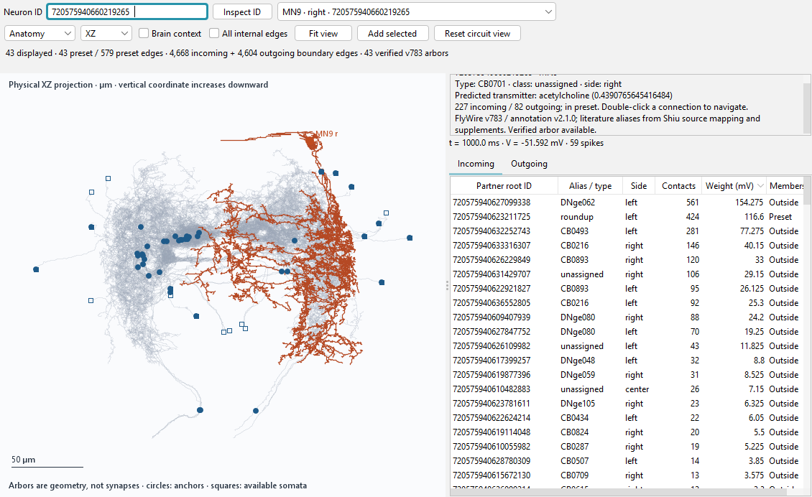
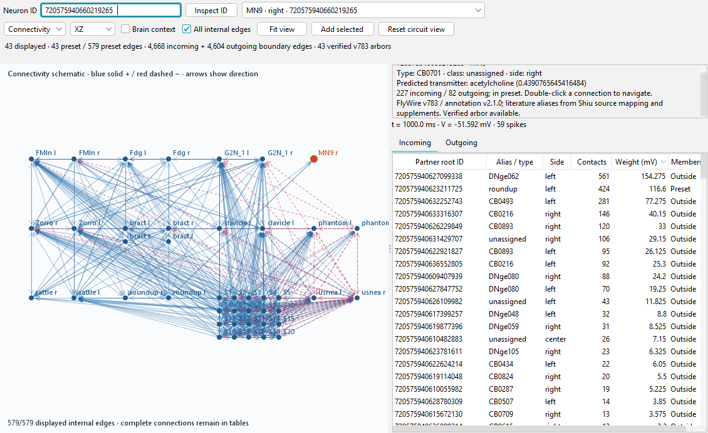

# Circuit validation on MSI

The identified circuit, full connection inspector, anatomical projections and workspace restoration are implemented. Numerical and lifecycle checks pass. Performance measurements below are desktop observations on a shared machine, not an isolated throughput benchmark. Do not infer zero overhead from a faster candidate run.

## Configuration and evidence

- Baseline A: `63a08a87c0c01b948a8804b2a5d1d5e07a298ecf`, with only the same validation harness and Gradle task added.
- Candidate B: circuit viewer closed. Candidate C: circuit viewer open. Both retain all 138,639 neurons and 15,091,983 directed edges.
- Final application code: `442c107d1913f3980b2cdebef1ba39fc3ae22015`. Measurement correction: `531b96c16bc050a558f977f9833853d35d9ac451` (harness only).
- MSI: Intel i5-13420H, 8 cores / 12 logical processors, 16,869,130,240 bytes RAM, Windows 11 Home 10.0.26200, Java 21.0.12.1, fixed 2 GiB maximum Java heap.
- One warmup and five measured one-second sugar runs per fresh Java process; seed 42, 100 Hz, normal whole-brain plots enabled. Every run checks 8,553 total spikes and 59 right-MN9 spikes. No benchmark/build processes owned by this task ran concurrently. Other activity on the shared desktop was left untouched.
- Raw TSV files and targeted JUnit XML are retained here. Percentiles use nearest rank. Windows process-memory measurements include native/runtime allocations; Java heap is measured after explicit GC. They are different quantities.

## Connectivity and numerical behavior

Eight targeted tests passed, zero failed and zero skipped (three circuit, four brain, one annotation). The XML records the earlier full-data run; subsequent application changes affect painting and initial frame sizing only. Final application and snapshot sources also compile successfully on MSI.

All 43 preset IDs and arbors resolve. All 9,851 incident directed edges are checked against canonical source/target indices and model weights: 579 internal, 4,668 incoming boundary, 4,604 outgoing boundary. Metadata covers all 1,936 distinct external partners. MN9 has 227 incoming and 82 outgoing edges. The explicitly checked left Roundup → right MN9 edge has 424 contacts and +116.6 mV drive. Twenty-one preset neurons have soma coordinates; all 43 have annotation anchors. Every anchor is within 1.685 µm of its source skeleton.

While real Swing selection and observer snapshots are active, the test compares every neuron's voltage, synaptic drive, spike count, last-spike tick and bin flags, plus RNG state, time and every delayed-event queue, at every 1 ms step. It then compares the complete ordered 0.1 ms spike events and verifies graph immutability. Five one-second conditions pass exactly:

| Seed | Input | Total spikes |
|---|---|---:|
| 42 | 100 Hz | 8,553 |
| 43 | 100 Hz | 9,088 |
| 44 | 100 Hz | 8,861 |
| 42 | Off | 0 |
| 42 | 200 Hz | 16,098 |

The existing Brian2 reference comparison and saved-state test also pass. These are fidelity checks for the uniform reference model; they do not establish biological sufficiency of an isolated 43-neuron circuit or validate new neuron-type dynamics.

## Interface and lifecycle

Actual desktop checks exercise 100 selections while simulating, all three physical projections, zoom, numeric sorting, external-partner double-click navigation, adding/resetting displayed membership, ten close/open cycles, and saving/reopening the actual workspace. Reopened dynamics and view mode are checked. Every completed C run reports zero observer worker threads after closing.

The anatomy image uses physical micrometres, verified arbors, anchor circles and available soma squares. Whole-brain anchor context can be enabled; it is disabled in this image to fit the circuit closely. The schematic is grouped by alias and has no anatomical-distance meaning. All-edge rendering is deliberately dense; selected-edge mode, exact IDs and complete sortable tables support inspection. Tables scroll horizontally and vertically. No spatial synapse locations are claimed.

## Optimization history and measurement limits

The initial implementation redrew all 193,622 arbor segments on every selection. Its pilot selection median/p95 were 177/255 ms; active browsing made the first simulated second take 26.97 seconds. That failed the proposed 100 ms selection target. The original pilot C summary was recorded during investigation; its raw TSV was overwritten by the next run and is not presented as retained evidence.

The first optimization retains a background raster across selection changes. Its retained raw results are `background-cache-C.tsv`: selection median 47.95 ms, p95 109.30 ms; dispatch-delay p95 39.28 ms, maximum 166.57 ms. The second optimization also retains the selected-neuron raster across unrelated Swing repaints. `reverse-C-mixed.tsv` records median 42.15 ms / p95 109.29 ms, dispatch-delay p95 34.15 ms / maximum 149.65 ms, and initial opening 596.61 ms.

In those runs, each tenth iteration queued a projection/zoom/sort change. Its unfinished repaint was charged to the next selection. The final harness explicitly completes painting for each selection and separately records the combined projection/zoom/sort operation. The earlier mixed measurements remain here rather than being silently discarded.

The proposed targets are initial opening ≤2 seconds; cached-selection p95 ≤100 ms; dispatch-delay p95 ≤100 ms and maximum ≤500 ms; median whole-brain runtime overhead ≤10%; additional steady memory ≤128 MiB and peak ≤256 MiB; stable retention across ten open/close cycles. A workflow `PASS` in a TSV means the functional assertions passed, not that every performance target passed.

## Final measurements

The final painted-interaction run (`painted-C.tsv`) meets the proposed interaction targets. Median runtime also falls within the proposed 10% margin in the adjacent reverse-order comparison; this is an observed result, not a precise causal estimate of overhead on a busy machine.

| Measure | Final C | Target / interpretation |
|---|---:|---|
| Initial open, including painting | 670.17 ms | ≤2,000 ms; pass |
| 100 cached selections, median / p95 / max | 56.47 / 81.60 / 118.21 ms | p95 ≤100 ms; pass |
| 10 combined projection/zoom/sort operations, median / max | 82.36 / 139.61 ms | Reported separately; includes full repaint |
| 20 ms Swing heartbeat dispatch delay, p95 / max | 40.62 / 143.88 ms | ≤100 / ≤500 ms; pass |
| Java heap increase on opening | 15.85 MiB | ≤128 MiB steady; pass |
| Windows private memory increase on opening | 1.61 MiB | Process-level observation; allocation reuse affects this delta |
| Peak working-set increase through save/reopen/close | 167.25 MiB | ≤256 MiB; pass, includes workspace restoration |
| Observer workers after closing | 0 | Pass |

Ten reopen heap samples range from 289.84 to 291.54 MiB; the last is below the first, with no monotonic cycle growth. Heap after complete workspace restoration and closing is 348.58 MiB versus 268.18 MiB before initial opening. This larger retained heap includes workspace/plot restoration; it is reported rather than described as fully recovered viewer memory. Ten observer reopen cycles are tested, not ten full-workspace restores.

| Sequence / condition | Median wall seconds per simulated second | Notes |
|---|---:|---|
| Early A baseline | 8.213 | Original harness window bounds |
| Early B closed | 9.392 | +14.35% relative to early A; did not meet runtime target |
| Reverse C open, mixed timing | 10.677 | Final application, earlier measurement harness |
| Reverse B closed | 17.088 | Same application; fresh process |
| Reverse A baseline | 16.694 | Same screen-sized harness |
| Final C open, completed painting | 17.415 | +4.32% versus adjacent A; +1.91% versus B |

Each row contains five measured runs after warmup. Final C includes one active-browsing run of 23.225 seconds and four otherwise idle-viewer runs of 17.196–17.696 seconds; the median must not conceal the extra cost of intensive interaction. In the reverse mixed run, active browsing took 15.351 seconds. Baseline runtime itself changed by roughly 2× between sequences, so the early +14.35% and later +4.32% cannot be treated as controlled estimates. The full raw samples remain available. The circuit representation preserves exact outputs in every timed run.

**Review decision:** the requested first circuit deliverable and its comparison are ready for review. Observed final targets pass; isolated-machine benchmarking remains necessary before claiming a stable small throughput overhead. Issue #3 should close when this implementation is accepted and merged, rather than from numerical tests alone.

## Extension decision

Keep the full sparse whole-brain model authoritative and expand a bounded view by following real connections. This avoids assuming that 138,639 individual Swing objects and 15 million drawn edges would be usable. The current canvas caps displayed membership at 100, drawn schematic edges at 2,000, external incoming caches at 32 neurons and extra annotation caches at 128. Connection tables remain complete. A first uncached external incoming query scans the full graph on the worker and is not covered by the cached-selection latency claim. Only the 43 pinned arbors are bundled.

Native editing belongs with #4, and heterogeneous physiology with #5/#7. Future large views should add spatial/connection indexing and a drawing level-of-detail strategy, with the same whole-brain fidelity and memory checks. Replacing the exact reference rule with scalar Simbrain integrate-and-fire neurons would change numerical behavior and is not justified by this representation work.
